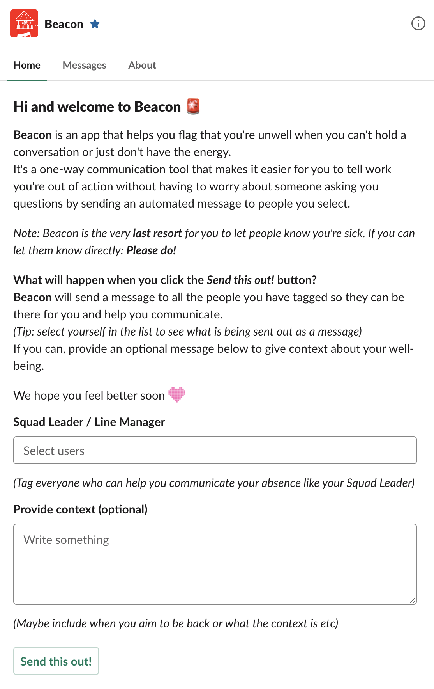

# Beacon

> A Slack bot that creates a one-way communication channel to people for when you're too sick to deal with human interaction but still need to let people know you're not well.

	

## Content

- [Installation](#installation)
- [Customization](#customization)
- [Development](#development)
- [Version History](#version-history)

## Installation

To install this app yourself you have to host it online and install a new app in slack via https://api.slack.com/apps.
It will need bot token scope:

- `chat:write`
- `chat:write.customize`
- `im:read`
- `im:write`
- `users:read`

And you'll need to copy the `User OAuth Token` and the `Bot User OAuth Token` into your `.env` file which you can get from the `OAuth & Permissions` page of your app.

Lastly you have to add the url to Slack in both the `Event Subscriptions` and `Interactivity & Shortcuts` sections. Note that the app is listening on the path `slack/events`.

## Customization

This app comes with a home screen that allows you to send messages to people in the slack workspace.

	

You can make changes to the home screen by editing the `src/home.js` file.
Use the https://app.slack.com/block-kit-builder to help you edit this file.

## Development

To run this repo please install dependencies via `yarn` and run the app via `yarn start`.
After changes please run `yarn format` to run `prettier`.

## Version History

- v1.0.0 - First release
